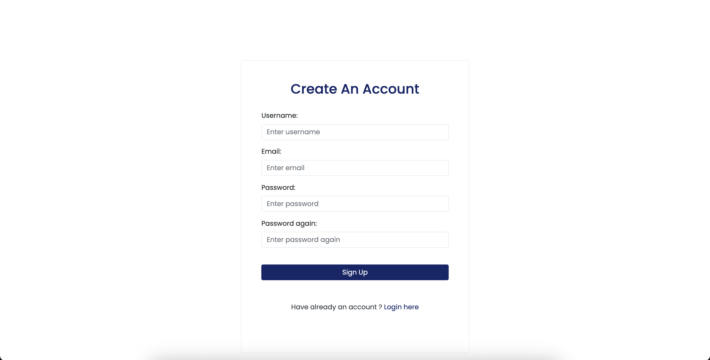
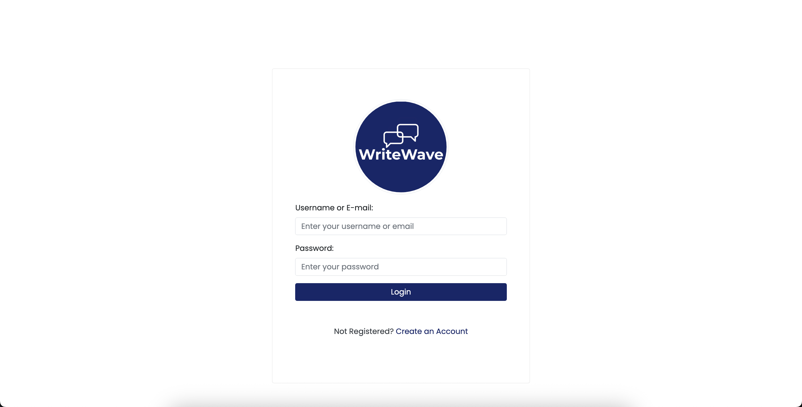
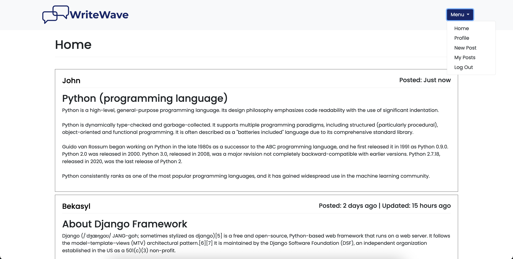
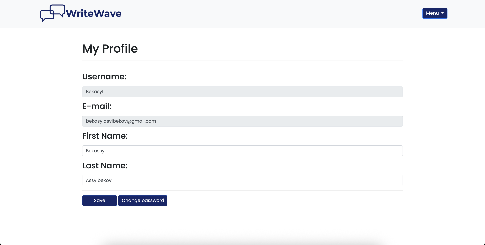
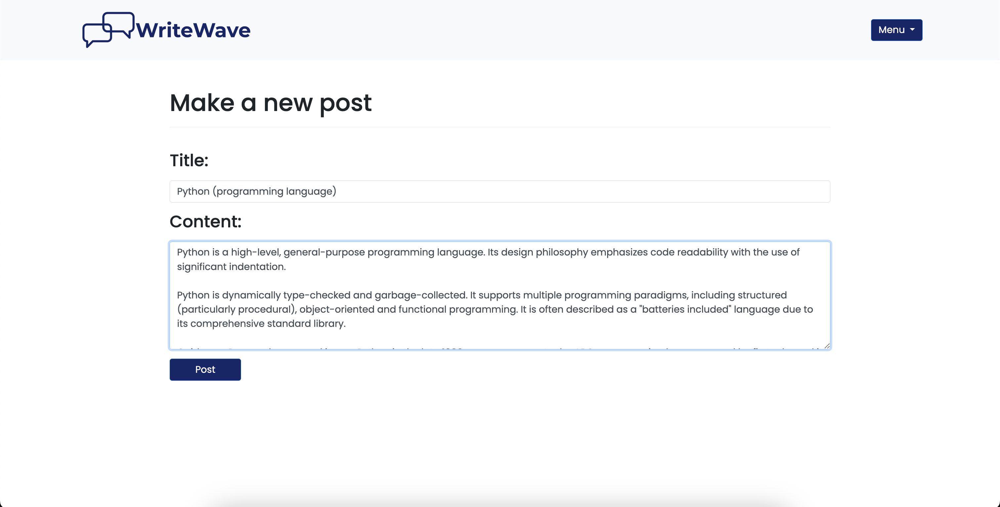
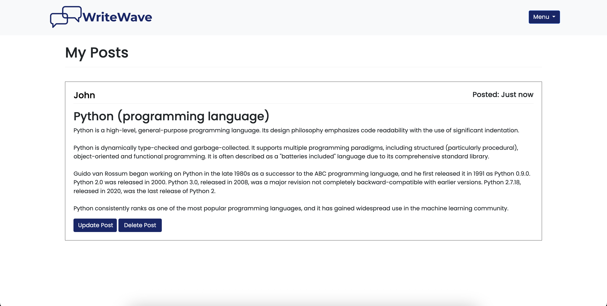

# 📝 Django Blog Application

WriteWave - a clean and functional blog platform built with **Django 5**. This application enables users to create, read, update, and delete blog posts, handle user profiles, and authenticate using either a username or email.

---

## 🚀 Features

* User registration and login via **username or email**.
* Create, read, update, and delete blog posts.
* View and edit user profile.
* Password change functionality.
* Custom `time_since` filter for "time ago" post display.
* Pagination for posts.
* Clean Bootstrap 4 UI.
* PostgreSQL database support (with `.env` config).

---

## 🛠 Tech Stack

* **Backend**: Python 3, Django 5.
* **Frontend**: Bootstrap 4, HTML5, CSS3.
* **Database**: PostgreSQL (default), with optional SQLite support.
* **Other**:

  * Django Class-Based Views (CBVs).
  * Custom authentication backend allows users to log in with either a username or email
  * Custom template tags (`time_since_custom`).

---

## 🖼 Screenshots

---

## 🧑‍💻 Author

* Bekassyl ([GitHub Profile](https://github.com/bekasyll))

